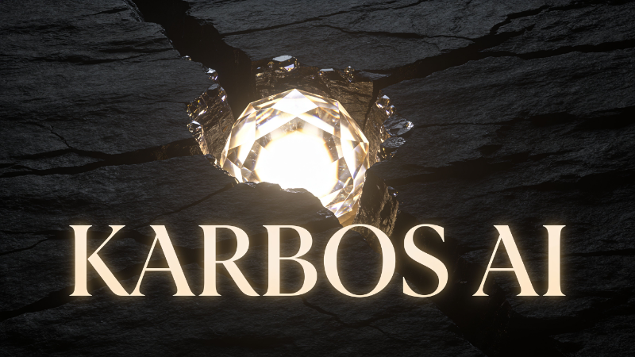

<!-- prettier-ignore -->
<div align="center">
  <h1>KARBOS AI: AI-Powered Coal Petrographic Analysis Copilot</h1>
  
  <p>Segmentation of coal macerals using a DA-VIT Vision Transformer</p>

  <a href="https://www.python.org/downloads/">
    
  </a>

  <a href="https://streamlit.io/">
    
  </a>

  <a href="https://pytorch.org/">
    
  </a>

  <a href="https://arxiv.org/abs/2506.12712">
    
  </a>

  <a href="https://github.com/Nasor2/coal-maceral-segmentation">
    
  </a>

  <br /><br />

  [Overview](#overview) · [Key Features](#key-features) · [How It Works](#how-it-works) · [Quick Start](#quick-start) · [Project Structure](#project-structure) · [Model Performance](#model-performance) · [Coal Quality Metrics](#coal-quality-metrics) · [Testing](#testing) · [Deployment](#deployment) · [References](#references)
</div>

---

## Overview

**Karbos AI** is an early-stage prototype of an intelligent copilot for coal petrographers. It uses a **DA-VIT (Dilation-based Attention Vision Transformer)** deep learning model to automatically segment coal macerals from polarized light microscopy images, providing quantitative composition analysis in seconds rather than hours.

> [!NOTE]
> This is a **research prototype**, not a production system. The AI serves as an assistant — the certified petrographer retains full authority over the final report. The model provides initial segmentations that the expert reviews, corrects, and validates.

### The Problem

Traditional coal petrographic analysis (ASTM D2799 / ISO 7404-3) requires counting **500–1,000 points per sample** under a microscope — a manual process taking **4–8 hours per sample**. Laboratories face growing demand but limited skilled workforce.

### Our Approach

Karbos AI segments macerals automatically, allowing the petrographer to **review and validate** rather than count from scratch. The same price per sample to the end client, but **up to 8x more samples per workday**.

---

## Key Features

### 🔬 Automatic Maceral Segmentation
Identifies **Vitrinite**, **Inertinite**, **Liptinite**, and **Background** using a DA-VIT-Tiny model with 4.95M parameters.

### 📊 Quality Metrics Calculation
Computes industry-standard metrics: **TRI** (Total Reactivity Index), **V/I** (Vitrinite/Inertinite ratio), and **R/I** (Reactive/Inert ratio) for coking quality assessment.

### 🏭 Industrial Classification
Automatically classifies coal into categories: **Primary Cokable**, **Secondary Cokable**, **Liptinite-Rich**, **Thermal**, or **Mixed** based on maceral composition.

### 📈 Proximate Analysis Estimates
Provides approximate **Volatile Matter (VM%)**, **Fixed Carbon (FC%)**, and **Calorific Value (CV)** from maceral composition using literature correlations.

### 🖼️ Multi-Image Analysis
Upload multiple images from the same briquette for **statistical aggregation** (mean ± standard deviation), improving representativeness.

### 🎯 Confidence Mapping
Visualizes model certainty per pixel — **green** (high confidence ≥90%), **yellow** (medium), **orange** (low <75%) — highlighting areas needing expert review.

### 🌐 Web-Based Interface
Built with **Streamlit**, accessible from any browser. No installation required for end users when deployed on Streamlit Community Cloud.

---

## How It Works

```
Input Image (TIFF/PNG/JPEG)
        │
        ▼
┌─────────────────┐
│   Preprocessing  │  Resize 512×512, normalize (ImageNet)
└────────┬────────┘
         │
         ▼
┌─────────────────┐
│   DA-VIT-Tiny   │  4.95M params, 4 stages with DCSA blocks
│   (Encoder)     │  Dilation-based Convolutional Self-Attention
└────────┬────────┘
         │
         ▼
┌─────────────────┐
│   FPN Decoder   │  Feature Pyramid Network + classification head
└────────┬────────┘
         │
         ▼
┌─────────────────┐
│  Maceral Mask   │  4 classes: Vitrinita, Inertinita, Liptinita, Fondo
│  + Confidence   │
└────────┬────────┘
         │
         ▼
┌─────────────────┐
│    Analysis     │  Composition %, TRI, V/I, R/I, classification
└─────────────────┘
```

---

## Quick Start

### Prerequisites

- Python 3.10 or higher
- Git

### Installation

```bash
# Clone the repository
git clone https://github.com/Nasor2/karbos-ai.git
cd karbos-ai

# Create and activate virtual environment
python -m venv .venv
source .venv/bin/activate  # Linux/macOS
# .venv\Scripts\activate   # Windows

# Install dependencies
pip install -r requirements.txt
```

> [!TIP]
> The model checkpoint (~50 MB) is **automatically downloaded** from GitHub Releases on first run. No manual download required.

### Run the Application

```bash
streamlit run app.py
```

The app will open in your browser at `http://localhost:8501`. Upload coal microscopy images and view the analysis results.

> [!NOTE]
> Inference runs on CPU by default. Processing time is approximately 15–30 seconds per image depending on your hardware.

---

## Project Structure

```
karbos-ai/
├── app.py                  # Streamlit UI — layout, charts, multi-image gallery
├── model.py                # DA-VIT architecture (DCSA, DCSABlock, PatchEmbed, FPN)
├── inference.py            # Load model, preprocess, predict, decode mask
├── metrics.py              # TRI, V/I, R/I, classification, proximate estimates
├── config.py               # Constants: colors, normalization, thresholds
├── requirements.txt        # Dependencies (PyTorch CPU, Streamlit, Plotly)
├── pyproject.toml          # Python project config (ruff, pytest)
├── banner.png              # Project banner image
├── .streamlit/
│   └── config.toml         # Dark industrial theme configuration
└── tests/
    ├── conftest.py         # Test fixtures
    ├── test_config.py      # Config constants tests
    ├── test_model.py       # DA-VIT architecture tests
    ├── test_inference.py   # Inference pipeline tests
    └── test_metrics.py     # Coal quality metrics tests
```

---

## Model Performance

The DA-VIT-Tiny model was trained on the [Mendeley coal maceral dataset](https://doi.org/10.17632/ds6vk7m3m7.1) (304 image-mask pairs).

| Metric | Value |
|:-------|------:|
| **Pixel Accuracy** | 81.23% |
| **Mean IoU** | 60.27% |
| **Parameters** | 4.95M |
| **Input Size** | 512 × 512 RGB |

### Per-Class IoU

| Class | IoU (%) | Pixel Distribution |
|:------|--------:|-------------------:|
| Vitrinite | 65.57 | 31.2% |
| Inertinite | 57.55 | 15.5% |
| Liptinite | 39.88 | 4.9% |
| Background | 78.07 | 48.3% |

> [!IMPORTANT]
> Liptinite has the lowest IoU (39.88%) due to its small pixel distribution (4.9%). This is a known limitation — the model struggles with rare classes. Future work should address class imbalance.

---

## Coal Quality Metrics

The prototype computes standard coal quality metrics from maceral composition:

| Metric | Formula | Interpretation |
|:-------|:--------|:---------------|
| **TRI** (Total Reactivity Index) | V + 0.5 × L | >60: high reactive potential |
| **V/I** (Vitrinite/Inertinite) | V / I | >1.5: primary cokable |
| **R/I** (Reactive/Inert) | (V + L) / (I + B) | 1.5–2.5: optimal coking range |
| **%Reactivos** | V + L | Plasticizing fraction |
| **%Inertes** | I + B | Diluent fraction |

### Industrial Classification

| Type | Criterion | Application |
|:-----|:----------|:------------|
| **Primary Cokable** | V > 60% AND V/I > 1.5 | Direct metallurgical coking |
| **Secondary Cokable** | V > 50% AND V/I > 1.5 | Blending for coking |
| **Liptinite-Rich** | L > 20% | High VM, liquefaction |
| **Thermal** | I > 50% | Power generation |
| **Mixed** | Other | Case-by-case evaluation |

> [!WARNING]
> Proximate estimates (VM%, FC%, CV) are **approximations** based on literature correlations with ±15–20% error. Always use accredited laboratory analysis for industrial decisions.

---

## Testing

```bash
# Run all tests
.venv/bin/pytest tests/ -v

# Run with coverage
.venv/bin/pytest tests/ -v --tb=short

# Lint check
.venv/bin/ruff check .
```

The test suite includes **51 tests** covering:
- Configuration constants validation
- DA-VIT architecture shape and parameter checks
- Inference pipeline correctness
- Coal quality metric calculations
- Edge cases (empty lists, extreme compositions, division by zero)

---

## Deployment

### Streamlit Community Cloud (Free)

1. Push this repository to GitHub (public)
2. Go to [share.streamlit.io](https://share.streamlit.io)
3. Connect your GitHub account
4. Select the `karbos-ai` repository and `app.py` as the entry point
5. The model checkpoint auto-downloads on first start

> [!TIP]
> The free tier provides sufficient resources for this prototype. The CPU-only PyTorch install (~200 MB) keeps the deployment lightweight.

### Production Stack (Future)

The full SaaS platform will use:
- **Backend:** Spring Boot (hexagonal architecture) on Oracle Cloud
- **AI Inference:** FastAPI + PyTorch/ONNX
- **Frontend:** Next.js on Vercel
- **Database:** OCI Autonomous DB (PostgreSQL)
- **Storage:** OCI Object Storage

---

## References

1. **DA-VIT Paper:** [Dilation-based Attention Vision Transformer for Coal Maceral Segmentation](https://arxiv.org/abs/2506.12712)
2. **Original Repository:** [Nasor2/coal-maceral-segmentation](https://github.com/Nasor2/coal-maceral-segmentation)
3. **Dataset:** [Mendeley Coal Maceral Dataset](https://doi.org/10.17632/ds6vk7m3m7.1) (Xu et al., 2024)
4. **Standards:** ASTM D2799 / ISO 7404-3 (Coal petrographic analysis by point count)

---

## Citing This Project

If you use this work in your research, please cite:

```bibtex
@software{karbos_ai_2026,
  title  = {Karbos AI: AI-Powered Coal Petrographic Analysis Copilot},
  author = {Karbos AI Team},
  year   = {2026},
  url    = {https://github.com/Nasor2/karbos-ai},
  note   = {Early-stage prototype using DA-VIT for maceral segmentation}
}
```

---

## Acknowledgments

- **Model Architecture:** Based on the DA-VIT paper by Xu et al. (2025)
- **Dataset:** Coal maceral images from Mendeley Data (Xu, Wang, Li et al., 2024)
- **Framework:** Built with [Streamlit](https://streamlit.io/) and [PyTorch](https://pytorch.org/)
- **Charts:** Interactive visualizations powered by [Plotly](https://plotly.com/python/)

---

<div align="center">
  <strong>Karbos AI</strong> — Early-stage prototype for coal petrographic analysis
  <br />
  Built as a copilot, not a replacement, for certified petrographers
</div>
