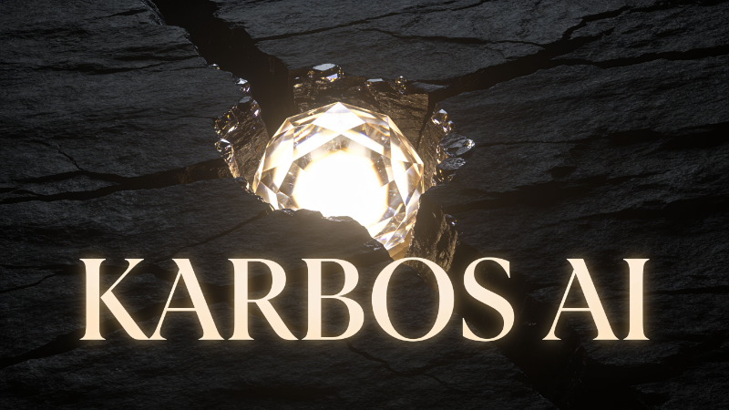

<!-- prettier-ignore -->
<div align="center">
  <h1>KARBOS AI: AI-Powered Coal Petrographic Analysis Copilot</h1>
  

  [](https://www.python.org/downloads/)
  [](https://streamlit.io/)
  [](https://pytorch.org/)
  [](https://arxiv.org/abs/2506.12712)
  [](LICENSE)

  <a href="https://karbos-ai.streamlit.app/">🔗 Live Demo</a> · <a href="#quick-start">Quick Start</a> · <a href="#key-features">Features</a>

</div>

---

## Overview

**Karbos AI** is an intelligent copilot for coal petrographers. It uses deep learning to automatically segment coal macerals from polarized light microscopy images, providing quantitative composition analysis in seconds rather than hours.

> [!NOTE]
> This is a **research prototype**, not a production system. The AI serves as an assistant — the certified petrographer retains full authority over the final report.

> [!TIP]
> **Try it now:** [karbos-ai.streamlit.app](https://karbos-ai.streamlit.app/) — no installation required.

### The Problem

Traditional coal petrographic analysis (ASTM D2799 / ISO 7404-3) requires counting **500–1,000 points per sample** under a microscope — a manual process taking **4–8 hours per sample**. Laboratories face growing demand but limited skilled workforce.

### Our Approach

Karbos AI segments macerals automatically, allowing the petrographer to **review and validate** rather than count from scratch.

---

## Key Features

- **Automatic Maceral Segmentation** — Identifies **Vitrinite**, **Inertinite**, **Liptinite**, and **Background** using a deep learning model.

- **Quality Metrics Calculation** — Computes industry-standard metrics for coking quality assessment.

- **Industrial Classification** — Classifies coal into **Primary Cokable**, **Secondary Cokable**, **Liptinite-Rich**, **Thermal**, or **Mixed** based on maceral composition.

- **Proximate Analysis Estimates** — Provides approximate **Volatile Matter (VM%)**, **Fixed Carbon (FC%)**, and **Calorific Value (CV)** from maceral composition.

- **Multi-Image Analysis** — Upload multiple images from the same briquette for **statistical aggregation** (mean ± standard deviation).

- **Confidence Mapping** — Visualizes model certainty per pixel, highlighting areas needing expert review.

- **Web-Based Interface** — Built with Streamlit, accessible from any browser.

---

## Quick Start

### Prerequisites

- Python 3.10 or higher
- Git

### Installation

```bash
git clone https://github.com/Nasor2/karbos-ai.git
cd karbos-ai

python -m venv .venv
source .venv/bin/activate  # Linux/macOS
# .venv\Scripts\activate   # Windows

pip install -r requirements.txt
```

> [!TIP]
> The model checkpoint (~50 MB) is **automatically downloaded** from GitHub Releases on first run.

### Run the Application

```bash
streamlit run app.py
```

The app will open in your browser at `http://localhost:8501`. Upload coal microscopy images and view the analysis results.

> [!TIP]
> No microscopy images? Click **"Cargar imágenes de demostración"** to run the analysis on sample images.

---

## Project Structure

```
karbos-ai/
├── app.py              # Streamlit UI — layout, charts, multi-image gallery
├── model_loader.py     # Model loading interface
├── predictor.py        # Prediction and analysis interface
├── metrics.py          # Coal quality metrics calculation
├── config.py           # Configuration constants
├── requirements.txt    # Dependencies
├── banner.png          # Project banner image
└── demo_images/        # Sample images for demonstration
```

---

## Technical Details

- **Model Architecture:** Based on DA-VIT (Dilation-based Attention Vision Transformer)
- **Reference Paper:** [arXiv:2506.12712](https://arxiv.org/abs/2506.12712)
- **Input:** 512×512 RGB images
- **Output:** Segmentation mask + composition analysis
- **Classes:** Vitrinite, Inertinite, Liptinite, Background

---

## References

1. **DA-VIT Paper:** [Dilation-based Attention Vision Transformer for Coal Maceral Segmentation](https://arxiv.org/abs/2506.12712)
2. **Dataset:** [Mendeley Coal Maceral Dataset](https://doi.org/10.17632/ds6vk7m3m7.1) (Xu et al., 2024)
3. **Standards:** ASTM D2799 / ISO 7404-3 (Coal petrographic analysis by point count)

---

## Citing This Project

If you use this work in your research, please cite:

```bibtex
@software{pena_ortega_2026,
  author    = {Peña Ortega, Samuel Nissi},
  title     = {Karbos AI: AI-Powered Coal Petrographic Analysis Copilot},
  year      = {2026},
  url       = {https://github.com/Nasor2/karbos-ai},
  license   = {MIT}
}
```

---

<div align="center">
  <strong>Karbos AI</strong> — AI-powered copilot for coal petrographic analysis
  <br />
  Built as a copilot, not a replacement, for certified petrographers
</div>
